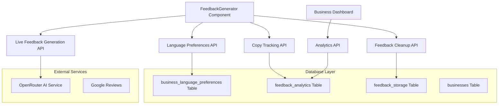

# Design Document

## Overview

This design enhances the existing feedback system with comprehensive tracking and analytics capabilities. The system will dynamically load language preferences from the database, provide immediate feedback generation on language selection, track user interactions for business analytics, and implement proper feedback lifecycle management.

The design maintains backward compatibility while adding new features for tracking review copies, managing feedback cleanup, and providing analytics data for business dashboards.

## Architecture

### High-Level Architecture



### Data Flow

1. **Page Load**: Fetch business language preferences and display dynamic language buttons
2. **Language Selection**: Immediately generate new feedback in selected language
3. **Copy Action**: Track interaction, cleanup feedback, redirect to Google Reviews
4. **Analytics**: Aggregate tracking data for business dashboard consumption

## Components and Interfaces

### Frontend Components

#### Enhanced FeedbackGenerator Component

**Location**: `src/components/feedback/FeedbackGenerator.tsx`

**New State Management**:
```typescript
interface LanguagePreference {
  language_code: string;
  language_name: string;
}

interface FeedbackAnalytics {
  copyCount: number;
  lastCopyTimestamp: string;
  languageBreakdown: Record<string, number>;
}

// New state variables
const [availableLanguages, setAvailableLanguages] = useState<LanguagePreference[]>([]);
const [selectedLanguageCode, setSelectedLanguageCode] = useState<string>('en');
```

**Enhanced Functionality**:
- Dynamic language button rendering based on database preferences
- Immediate feedback generation on language selection
- Copy tracking with analytics data submission
- Feedback cleanup after successful copy operations

### Backend APIs

#### Language Preferences API

**Endpoint**: `GET /api/businesses/[id]/language-preferences`

**Purpose**: Fetch available languages for a specific business

**Response Format**:
```typescript
{
  languages: [
    {
      language_code: "en",
      language_name: "English"
    },
    {
      language_code: "hi", 
      language_name: "हिंदी"
    }
  ]
}
```

#### Enhanced Live Feedback Generation API

**Endpoint**: `POST /api/businesses/[id]/generate-live-feedback`

**Enhanced Request Format**:
```typescript
{
  language_code: string;  // Changed from language to language_code
  businessName: string;
  businessType?: string;
  businessTags?: string;
}
```

**Enhanced Functionality**:
- Accept `language_code` parameter from database
- Map language codes to appropriate AI prompts
- Store generated feedback with language metadata

#### Copy Tracking API

**Endpoint**: `POST /api/businesses/[id]/track-copy`

**Purpose**: Track review copy interactions and cleanup feedback

**Request Format**:
```typescript
{
  language_code: string;
  feedback_id?: string;  // Optional feedback ID for cleanup
}
```

**Response Format**:
```typescript
{
  success: boolean;
  analytics: {
    totalCopies: number;
    languageBreakdown: Record<string, number>;
  }
}
```

#### Analytics API

**Endpoint**: `GET /api/businesses/[id]/analytics`

**Purpose**: Provide analytics data for business dashboard integration

**Response Format**:
```typescript
{
  totalCopies: number;
  languageBreakdown: {
    [language_code: string]: {
      count: number;
      language_name: string;
    }
  };
  recentActivity: {
    date: string;
    copies: number;
  }[];
  lastUpdated: string;
}
```

## Data Models

### Database Schema Changes

#### New Table: feedback_analytics

```sql
CREATE TABLE feedback_analytics (
  id SERIAL PRIMARY KEY,
  business_id UUID NOT NULL REFERENCES businesses(id),
  language_code VARCHAR(10) NOT NULL,
  copy_count INTEGER DEFAULT 0,
  last_copy_timestamp TIMESTAMP DEFAULT CURRENT_TIMESTAMP,
  created_at TIMESTAMP DEFAULT CURRENT_TIMESTAMP,
  updated_at TIMESTAMP DEFAULT CURRENT_TIMESTAMP,
  
  UNIQUE(business_id, language_code)
);

CREATE INDEX idx_feedback_analytics_business_id ON feedback_analytics(business_id);
CREATE INDEX idx_feedback_analytics_timestamp ON feedback_analytics(last_copy_timestamp);
```

#### New Table: feedback_storage (Optional)

```sql
CREATE TABLE feedback_storage (
  id SERIAL PRIMARY KEY,
  business_id UUID NOT NULL REFERENCES businesses(id),
  language_code VARCHAR(10) NOT NULL,
  feedback_text TEXT NOT NULL,
  created_at TIMESTAMP DEFAULT CURRENT_TIMESTAMP,
  
  INDEX idx_feedback_storage_business_lang (business_id, language_code)
);
```

#### Existing Table: business_language_preferences

```sql
-- Already exists as provided by user
CREATE TABLE business_language_preferences (
  id SERIAL NOT NULL,
  business_id UUID NOT NULL,
  language_code VARCHAR(10) NOT NULL,
  language_name VARCHAR(100) NOT NULL,
  created_at TIMESTAMP DEFAULT CURRENT_TIMESTAMP
);
```

### Language Code Mapping

**Standard Language Codes**:
- `en` - English
- `hi` - Hindi (हिंदी)
- `gu` - Gujarati (ગુજરાતી)

**AI Prompt Mapping**:
```typescript
const languagePrompts = {
  en: "Generate in English...",
  hi: "हिंदी में उत्तर दें...",
  gu: "ગુજરાતીમાં જવાબ આપો..."
};
```

## Error Handling

### Frontend Error Handling

1. **Language Loading Failures**: Fallback to English if language preferences can't be loaded
2. **Feedback Generation Failures**: Use template-based fallbacks with language-specific templates
3. **Copy Tracking Failures**: Log errors but don't interrupt user experience
4. **Network Timeouts**: Implement retry logic with exponential backoff

### Backend Error Handling

1. **Database Connection Issues**: Graceful degradation with in-memory fallbacks
2. **AI Service Failures**: Template-based feedback generation
3. **Invalid Language Codes**: Default to English with error logging
4. **Analytics Tracking Failures**: Async error logging without blocking main flow

### Error Response Format

```typescript
{
  error: string;
  code: string;
  details?: any;
  fallback?: any;  // Fallback data when available
}
```

## Testing Strategy

### Unit Tests

1. **Language Preference Loading**
   - Test dynamic language button rendering
   - Test fallback to English when no preferences exist
   - Test handling of 1-3 language configurations

2. **Feedback Generation**
   - Test immediate generation on language selection
   - Test language code mapping to AI prompts
   - Test fallback template selection

3. **Copy Tracking**
   - Test analytics data increment
   - Test feedback cleanup after copy
   - Test error handling when tracking fails

4. **Analytics API**
   - Test data aggregation accuracy
   - Test language breakdown calculations
   - Test business-specific data filtering

### Integration Tests

1. **End-to-End User Flow**
   - Load page → Select language → Generate feedback → Copy review
   - Verify analytics tracking throughout the flow
   - Verify Google Reviews redirect functionality

2. **Database Operations**
   - Test concurrent copy tracking updates
   - Test feedback cleanup operations
   - Test analytics data consistency

3. **API Integration**
   - Test OpenRouter AI service integration with new language codes
   - Test error handling when external services fail
   - Test timeout and retry mechanisms

### Performance Tests

1. **Language Loading Performance**
   - Test page load time with dynamic language fetching
   - Test caching of language preferences

2. **Feedback Generation Speed**
   - Maintain sub-2 second generation time
   - Test concurrent generation requests

3. **Analytics Query Performance**
   - Test analytics API response time with large datasets
   - Test database query optimization

## Implementation Notes

### Migration Strategy

1. **Phase 1**: Add new database tables and API endpoints
2. **Phase 2**: Update frontend to use dynamic languages
3. **Phase 3**: Implement copy tracking and analytics
4. **Phase 4**: Add feedback cleanup functionality

### Backward Compatibility

- Existing hardcoded language support remains functional
- Gradual migration to dynamic language system
- Fallback mechanisms for businesses without language preferences

### Performance Considerations

- Cache language preferences to reduce database queries
- Implement database connection pooling for analytics operations
- Use async operations for non-critical tracking functionality
- Optimize analytics queries with proper indexing

### Security Considerations

- Validate business ownership for analytics access
- Sanitize language codes to prevent injection attacks
- Rate limiting on feedback generation and copy tracking
- Secure API endpoints with proper authentication